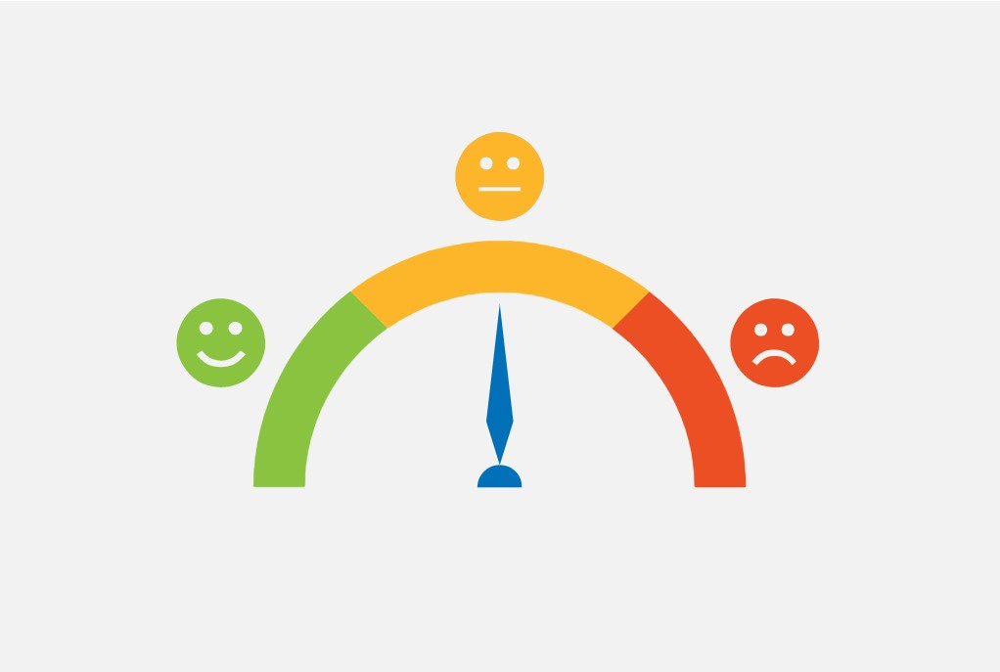
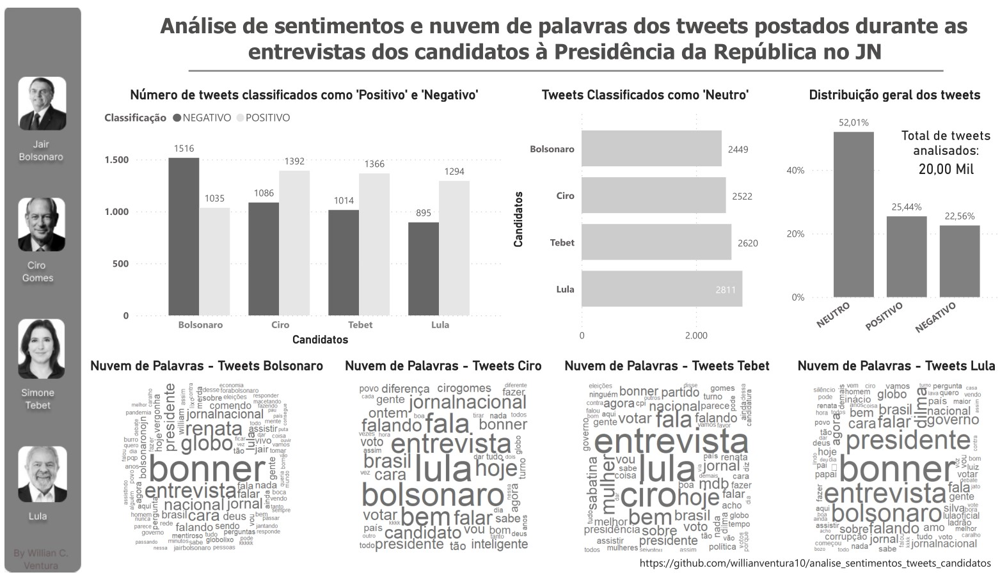

<h1 align=justify>Análise de sentimentos e nuvem de palavras dos tweets postados durante as entrevistas dos candidatos à Presidência da República no Jornal Nacional</h1>

  

# Índice
* [Sobre o Projeto](#computer-sobre-o-projeto)
* [Descrição Geral e Coleta](#mag-descrição-geral-e-coleta)
* [Limpeza e pré-processamento dos tweets](#soap-limpeza-e-pré-processamento-dos-tweets)
* [Análise de sentimentos](#gear-análise-de-sentimentos)
* [Nuvem de Palavras](#cloud-nuvem-de-palavras)
* [Dashboard](#rocket-dashboard)
* [Considerações finais](#bulb-considerações-finais)
* [Autor](#superhero-autor)

## :computer: Sobre o Projeto
<td>
O objetivo deste pequeno projeto é praticar os conhecimentos adquiridso em Web Scraping e Processamento de Linguagem Natural. Foi utilizada a linguagem R para coleta e processamento dos tweets, e o Dashboard foi elaborado utilizando o Power BI e o Figma. Gostaria de fazer duas ressalvas antes de avançar: 
1 - Este projeto não carrega nenhum tipo de viés político ou ideológico/partidário, como já mencionado, o objetivo é colocar em prática os conhecimentos adquiridos e para a coleta e tratamento dos tweets foram adotados procedimentos que visaram a isonomia em todo o processo.
2 - O algoritimo que faz a análise de sentimentos, pacote 'syuzhet', foi desenvolvido e testado para textos em inglês, no processo de análise as palavras em português são traduzidas automaticamente, e obviamente pode haver alguma interpretação equivocada quanto ao sentido da mesma. Está sendo utilizada a versão 1.0.6 do 'syuzhet'. Para maiores esclarecimentos sobre o pacote: https://cran.r-project.org/web/packages/syuzhet/index.html e https://programminghistorian.org/pt/licoes/analise-sentimento-R-syuzhet
</td>

## :mag: Descrição Geral e Coleta 
<td>
Para desenvolvimento do projeto foram coletados 10.000 tweets (excluídos os retweets) para cada canditado (termos pesquisados: 'Bolsonaro', 'Lula', 'Ciro', 'Tebet') nos dias das entrevistas, entre os dias 22/08/2022 e 26/08/2022 (sendo coletado os tweets de cada candidato no seu respectivo dia e hora da entrevista). A coleta consistiu em baixar 2.500 tweets no início da entrevista (quando o tempo começava a contar), 2.500 no tempo de 10 minutos, 2.500 no tempo de 20 minutos e 2.500 no tempo de 40 minutos quando se encerrava a entrevista. 
</td>

## :soap: Limpeza e pré-processamento dos tweets
<td>
Após coletar os 10.000 tweets de cada canditado durante suas respectivas entrevistas, foi realizado o processo de limpeza dos tweets, onde inicialmente foi realizado processo de filtragem por usuário (foi deixado apenas 1 tweet por usuário) e excluídos os tweets duplicados. Posteriormente foram realizados procedimentos de limpeza de pontuações, emojis e demais caracteres especiais. 
</td>

## :gear: Análise de sentimentos
<td>
Os tweets que sobraram do processo de limpeza e pré-processamento foram submetidos à análise de sentimentos através do pacote 'syuzhet'. <i>O pacote syuzhet funciona com quatro dicionários de sentimentos: Bing, Afinn, Stanford e NRC. Este último é o único disponível em vários idiomas, incluindo o português. Este vocabulário com valores de sentimentos negativos ou positivos e oito emoções foi desenvolvido por Saif M. Mohammad, um cientista do Conselho Nacional de Pesquisa do Canadá (NRC). O conjunto de dados foi construído manualmente através de pesquisas usando a técnica Maximum Difference Scaling ou MaxDiff, que avalia a preferência por uma série de alternativas (Mohammad e Turney). Assim, o léxico tem 14.182 palavras com as categorias de sentimentos positivos e negativos e as emoções de raiva, antecipação, repugnância, medo, alegria, tristeza, surpresa e confiança. Além disso, está disponível em mais de 100 idiomas (através de tradução automática). </i>https://programminghistorian.org/pt/licoes/analise-sentimento-R-syuzhet. 
</td>
<td>
Para cada tweet foi obtido o registro dos sentimentos e emoções presentes, de modo que obtivemos um dataframe com 10 colunas (8 colunas com as emoções citadas acima e 2 colunas com os sentimentos positivo e negativo), sendo que para este projeto nos interessou apenas a classificação final de cada tweet como positivo, negativo ou neutro. Para tanto, foi adicionado ao dataframe resultante a coluna referente à classifcação final do tweet, onde o mesmo foi classificado como positivo, caso o número registrado na coluna positivo fosse maior que o número registrado na coluna negativo, caso contrário seria classificado como negativo, e sendo iguais (registro positivo = registro negativo) o tweet seria classificado como neutro. Considerando que o processo de limpeza e pré-processamento deixou o número total de tweets diferente para cada candidato, foi necessário adotar o número de 5.000 tweets para cada um, logo, foi criado um novo dataframe composto por 5.000 tweets escolhidos aleatoriamente (já analisados e classificados) para cada canditado, posteriormente o dataframe foi exportado para um arquivo '.csv'.
</td>

## :cloud: Nuvem de Palavras
<td>
Após pré-processamento e limpeza (mas ainda não analisados e classificados), os tweets foram trabalhados utilizando o pacote de processamento de textos 'tm' onde pôde-se obter as palavras mais frequentes considerando todos os tweets de cada candidato, o nome do candito foi removido da lista de palavras frequentes dos seus respectivos tweets, posteriormente os dados foram exportados para um arquivo '.csv'. 
</td>

## :rocket: Dashboard
<td>
O Dashboard foi elaborado utilizando o Power Bi como ferramenta principal (tendo auxílio do Figma apenas para uma pequena melhoria visual), onde foram importados os dados das etapas anteriores e montados os gráficos. Para a nuvem de palavras foi utilizada linguagem R e o pacote 'wordcloud', foram consideradas palavras com frequência igual ou superior a 50 . 
</td>

  

## :bulb: Considerações finais
<td>
Analisando os resultados obtidos neste projeto apresentados através do Dashboard, podemos fazer algumas breves considerações: 
</td>
<td>
1 - Destaca-se o fato do candidato Jair Bolsonaro ser o único dos candidatos a apresentar o número de tweets classificados como 'negativo' superior aos classificados como 'positivo'. Essa informação coaduna com o fato do atual Presidente ter atualmente o maior índice de rejeição dentre os candidatos à presidência conforme as últimas pesquisas divulgadas*.  
</td>
<td>
2 - O percentual de tweets classificados como 'neutro' chama a atenção (mais de 50%), isso talvez tenha ocorrido devido à limitação do algoritmo em 'compreender' expressões digitadas incorretamente, palavras com duplo sentido ou acompanhadas de emojis necessários à compreensão do tweet, etc.  
</td>
<td>
3 - As palavras mais frequentes nos tweets dos candidatos, referem-se sobretudo aos entrevistadores e aos outros candidatos.  
</td>

*https://g1.globo.com/politica/eleicoes/2022/pesquisa-eleitoral/noticia/2022/08/29/ipec-bolsonaro-tem-47percent-de-rejeicao-e-lula-tem-36percent.ghtml

## :superhero: Autor
 
<i>Willian Ventura</i>

   
     

